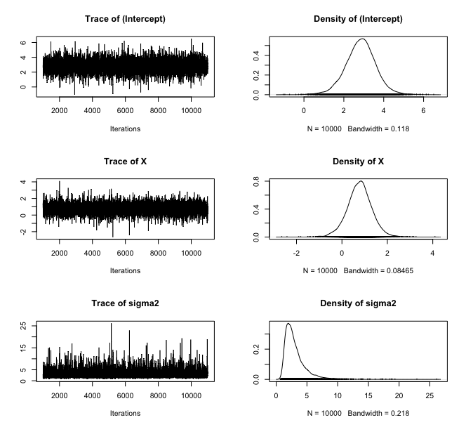

## MCMCpack package

#### Website basics

- Package source: https://github.com/cran/MCMCpack
- Package website: 
- Customized `pkgdown` components:
  - Change website theme to `lux` and set the navigation bar height to 100 pixels.
  - Specify a font for displaying code and set primary color theme (e.g, hyperlink and mousehover color) to bronze.
  - Add vignette contributor and table of contents to the side bar on homepage.
  - Add website designer to the footnote.
  - Reorder elements in the navigation bar and add my twitter link on the right corner.

#### Authors

##### Package development:
- Andrew D. Martin <admart@umich.edu>
- Kevin M. Quinn <kmq@umich.edu>
- Jong Hee Park <jongheepark@snu.ac.kr>

##### Vignette and website creation:
- Jianing Yao <jyao37@jhmi.edu>

#### Package description

`MCMCpack` (Markov Chain Monte Carlo Package) contains functions to perform Bayesian inference using posterior simulation for a number of statistical models. Most simulation is done in compiled C++ written in the Scythe Statistical Library Version 1.0.3. All models return 'coda' mcmc objects that can then be summarized using the 'coda' package. Some useful utility functions such as density functions, pseudo-random number generators for statistical distributions, a general purpose Metropolis sampling algorithm, and tools for visualization are provided.

#### (Major) Functions
 **Note: functions of common models and usage are listed here. For a full list of exported functions, please refer to the [manual](https://cran.r-project.org/web/packages/MCMCpack/MCMCpack.pdf). **

| Function Name               | Description                                                               |
|-----------------------------|---------------------------------------------------------------------------|
| `BayesFactor`               | Create an object of class BayesFactor from MCMCpack output                |
| `HMMpanelFE`                | Markov Chain Monte Carlo for the Hidden Markov Fixed-effects Model        |
| `HMMpanelRE`                | Markov Chain Monte Carlo for the Hidden Markov Random-effects Model       |
| `MCMCSVDreg`                | Markov Chain Monte Carlo for SVD Regression                                |
| `MCMChlogit`                | Markov Chain Monte Carlo for the Hierarchical Binomial Linear Regression Model using the logit link function |
| `MCMChpoisson`              | Markov Chain Monte Carlo for the Hierarchical Poisson Linear Regression Model using the log link function |
| `MCMChregress`              | Markov Chain Monte Carlo for the Hierarchical Gaussian Linear Regression Model |
| `MCMClogit`                 | Markov Chain Monte Carlo for Logistic Regression                           |
| `MCMCmnl`                   | Markov Chain Monte Carlo for Multinomial Logistic Regression               |
| `MCMCoprobit`               | Markov Chain Monte Carlo for Ordered Probit Regression                     |
| `MCMCpoisson`               | Markov Chain Monte Carlo for Poisson Regression                            |
| `MCMCprobit`                | Markov Chain Monte Carlo for Probit Regression                             |
| `MCMCregress`               | Markov Chain Monte Carlo for Gaussian Linear Regression                    |
| `MCbinomialbeta`            | Monte Carlo Simulation from a Binomial Likelihood with a Beta Prior       |
| `MCmultinomdirichlet`       | Monte Carlo Simulation from a Multinomial with a Normal Prior             |
| `MCnormalnormal`            | Monte Carlo Simulation from a Normal Likelihood (with known variance) with a Normal Prior |
| `MCpoissongamma`            | Monte Carlo Simulation from a Poisson Likelihood with a Gamma Prior       |
| `PostProbMod`               | Calculate Posterior Probability of Model                                  |


#### Examples
##### `MCbinomialbeta`: Monte Carlo Simulation from a Binomial Likelihood with a Beta Prior

```r
posterior <- MCbinomialbeta(3,12,mc=5000)
summary(posterior)
plot(posterior)
grid <- seq(0,1,0.01)
plot(grid, dbeta(grid, 1, 1), type="l", col="red", lwd=3, ylim=c(0,3.6),
     xlab="pi", ylab="density")
lines(density(posterior), col="blue", lwd=3)
legend(.75, 3.6, c("prior", "posterior"), lwd=3, col=c("red", "blue"))
```


##### `MCMCregress`: Markov Chain Monte Carlo for Gaussian Linear Regression

```r
line <- list(X = c(-2,-1,0,1,2), Y = c(1,3,3,3,5))
posterior <- MCMCregress(Y~X, b0=0, B0 = 0.1,
sigma.mu = 5, sigma.var = 25, data=line, verbose=1000)
plot(posterior)
raftery.diag(posterior)
summary(posterior)
```



#### Compilation

This package (along with Scythe) uses C++ and the Standard Template Library (STL).  We suggest using of the GCC compiler 4.0 or greater.  The current package has been tested using GCC 4.0 on Linux and MacOS X. 

Many thanks to Dan Pemstein for helping with all sorts of C++ issues, and to Kurt Hornik and Fritz Leisch for their help with debugging as well as their service to the R community.  We are also very grateful to Brian Ripley who provided C++ patches to fix a number of clang and Solaris issues. 

#### Acknowledgments

We gratefully acknowledge support from:

* National Science Foundation, Program in Methodology, Measurement, and Statistics, Grants SES-0350646 and SES-0350613

* Washington University, Department of Political Science, the Weidenbaum Center on the Economy, Government, and Public Policy (http://wc.wustl.edu), and the Center for Empirical Research in the Law (http://cerl.wustl.edu)

* Harvard University, Department of Government and the Institute for Quantitative Social Sciences (http://iq.harvard.edu)

Neither the National Science Foundation, Washington University, or Harvard University bear any responsibility for the content of this package.

Please contact Jong Hee Park <jongheepark@snu.ac.kr> if you have any problems or questions.

--
Jong Hee Park, Ph.D.
Associate Professor in Dept. Political Science and International Relations
Seoul National University

Email: jongheepark@snu.ac.kr

WWW: http://jhp.snu.ac.kr

